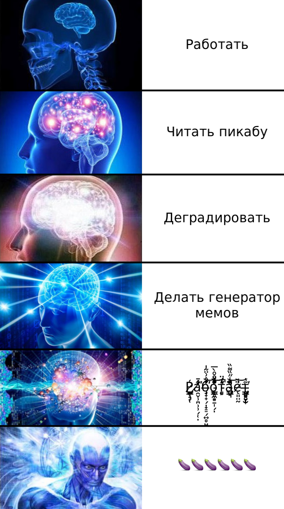
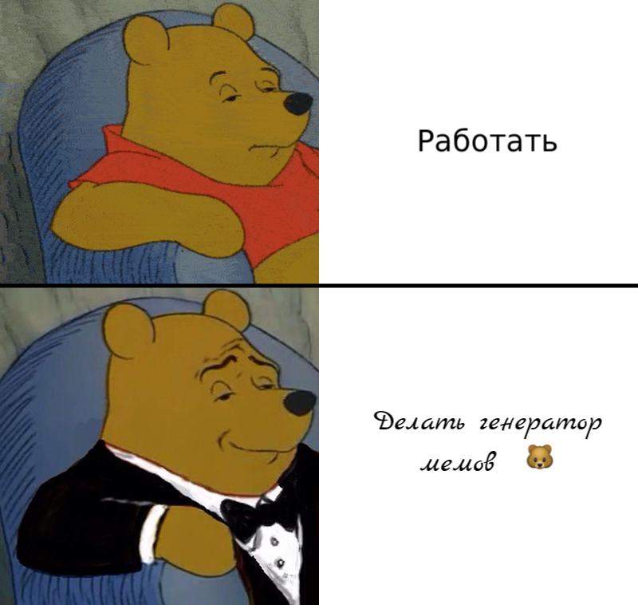

# Meme generator

Framework for generate memes using pycairo.

Builtin meme generators:

Supermind



Pooh



Borgar


## Requirements

* python-3.7
* pycairo
* poetry

* Tests
    * pytest
    * pytest-mypy

## Installing

```
sudo apt install \
    libgirepository1.0-dev \
    gcc libcairo2-dev \
    pkg-config python3-dev \
    gir1.2-gtk-3.0 \
    fontconfig
```


## Useful docs

* https://lazka.github.io/pgi-docs/PangoCairo-1.0/functions.html
* https://valadoc.org/pango/index.htm
